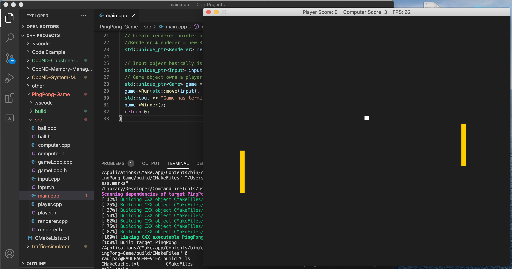
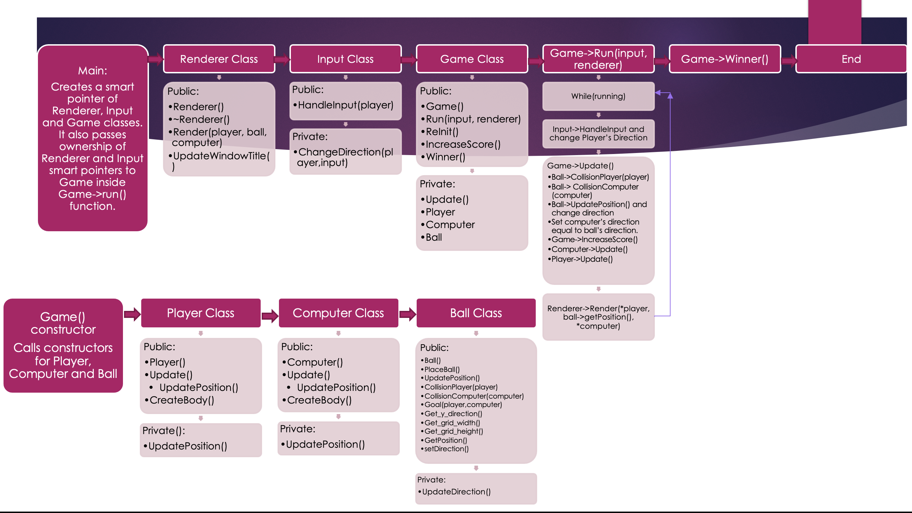

# Capstone Option 2.

## Ping-Pong Game

This project simulates a tennis table game between a _player_ and a _computer_. The _player_ controls a bar on the left hand of the screen with keys "up" and "down" on keyboard. The _computer_ also owns its own bar on the right side of the screen.
The objective of the game is that each player (human player or computer player) hits the ball scoring a point when the contrapart fails to return back the ball. The player with more points in the scoreboard wins the game.



### Dependencies for Running Locally
* cmake >= 3.11
  * All OSes: [click here for installation instructions](https://cmake.org/install/)
* make >= 4.1 (Linux, Mac), 3.81 (Windows)
  * Linux: make is installed by default on most Linux distros
  * Mac: [install Xcode command line tools to get make](https://developer.apple.com/xcode/features/)
  * Windows: [Click here for installation instructions](http://gnuwin32.sourceforge.net/packages/make.htm)
* gcc/g++ >= 5.4
  * Linux: gcc / g++ is installed by default on most Linux distros
  * Mac: same deal as make - [install Xcode command line tools](https://developer.apple.com/xcode/features/)
  * Windows: recommend using [MinGW](http://www.mingw.org/)
* SDL >= 2.0
  * All OSes: [click here for installation instructions](https://wiki.libsdl.org/Installation)

### Installation

1. Download PingPong-Game from [github repository](https://github.com/raulpac/PingPong-Game.git) or clone it from terminal with the following command:

`git clone "https://github.com/raulpac/PingPong-Game.git"`

2. Make a build directory in the top level directory: `mkdir build`
3. Then move into that directory `cd build`
3. Compile:
```
  cmake ..
  make
```
4. Run it: `./PingPong`.

### Class Structure

1. Main creates smart pointers of _Renderer, Input and Game_ classes.
  It also moves ownership of Renderer and Input from main scope to `Game->Run()` scoper.
  `Game->Run()` function contains the game logic and therefore the infinite game loop.
  When customer closes the program window the loop breaks and `Game->Winner()` function is called to declare the winner and finish the program.

2. When _Game_ constructor is called it also calls _Player, Computer and Ball_ constructors which creates and gives default coordinates to each object.

3. While `Game->Run()` is on execution, it will contain the infinite game loop which can be broken by closing the program window. Otherwise, it will call `Input->HandleInput(), Game->Update(), Renderer->Render()` functions to perform the basic logic for a game which is check for user inputs, update game logic, and render all visual objects.

    * `Input->HandleInput()`. Checks if _Player_ has pressed a key on keyboard and change the `player.direction` if necessary.
    * `Game->Update()`. 
    It calls several _Ball_'s functions. First it checks for collisions `Ball->CollisionPlayer()` and `Ball->CollisionComputer()`. If there is a collision it will change _collision_ property for _player_ and _computer_ respectively.
    Next, it calls `Ball->UpdatePosition()`in order to update the position and direction of Ball. Once this task is done, it sets the same direction to _Computer_ on `Computer->direction`.
    After, it runs `Game->IncreaseScore()`function which will check if a player has scored a point and calls `ReInit()` function to redraw _Player and Computer_ bodies on default positions. _Ball_ will be on the center of X axis and on a random position of Y axis with also a random `Ball->direction`.
    Finally, `Player->Update()` and `Computer->Update()`are called. Each of them call its own `UpdatePosition()` function in order to check `direction`and update each `bodyBar` with new coordinates accordingly.
    * `Renderer->Render()`. This function takes charges of clearing window, and rendering _Player, Computer and Ball_ objects on window with new positions.
    * Every second `renderer->UpdateWindowTitle()` will be called to update the window title. 
    * These steps will be repeated until user closes the window program.

4. The winnes is declared by calling Game->Winner() function and the winner's name is printed on screen terminal.



### Rubric points

* Loops, Functions, I/O.
  1. The project demonstrates an understanding of C++ functions and control structures.
      
      For instance: ***ball.h*** and ***ball.cpp*** contain control structures and code is organized into functions.
  
  2. The project accepts user input and processes the input.
    
      ***input.cpp*** file accepts user input and process it. Lines 16-34.

* Object Oriented Programming.
  1. The project uses Object Oriented Programming techniques.

      ***player.h***, ***computer.h*** and ***ball.h*** code is organized into classes with class attributes to hold the data, and class methods to perform tasks.

  2. Classes use appropriate access specifiers for class members.

      Any ***.h*** file shows that all class data members are explicitly specified as public, protected, or private.

  3. Classes encapsulate behavior.

      ***ball.h*** and ***gameloop.cpp*** lines 37-41 and 38, 71, 90 respectively.

* Memory Management.
  1. The project makes use of references in function declarations.

      ***gameloop.h*** file in line 19.
      ***renderer.h*** file in line 17.
      
  2. The project uses destructors appropriately.

      ***renderer.cpp** file in line 37.
      
  3. The project uses scope / Resource Acquisition Is Initialization (RAII) where appropriate.

      The project follows the Resource Acquisition Is Initialization pattern where appropriate, 
      by allocating objects at compile-time, initializing objects when they are declared, 
      and utilizing scope to ensure their automatic destruction.

  4. The project uses move semantics to move data, instead of copying it, where possible.

      ***main.cpp*** file in line 29.

  5. The project uses smart pointers instead of raw pointers.

      ***gameloop.h*** file in lines 26-30.
      ***gameloop.cpp*** file in lines 17-19.